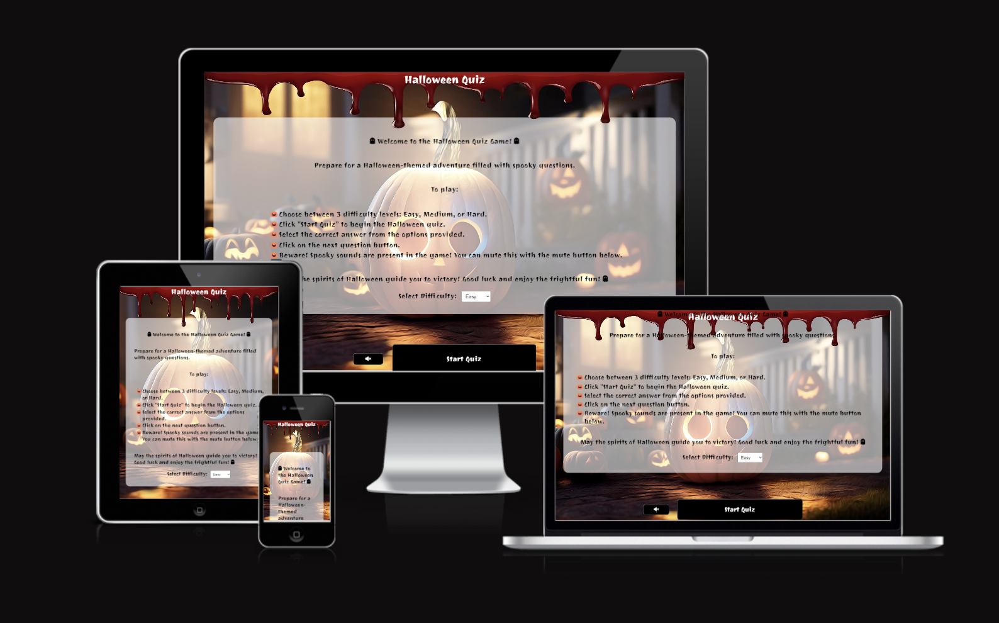

# Halloween Quiz Game

## Table of Contents

- [Description](#description)
- [Wireframing](#wireframe)
- [How to play](#how-to-play)
- [Full Testing Report](#full-testing-report)
- [Deployment](#deployment)
- [Screenshots](#screenshots)
- [Credits](#credits)
- [Potential Updates](#potential-updates)

## Description

Welcome to the Halloween Quiz game!
In this game, you'll be put to the test to see how well you know Halloween and every spooky thing that comes with it. Get ready to challenge your knowledge of all things spooky and Halloween-related! 
The game's navigation is facilitated through the button, and the scoring is automatically handled. 
Upon completing the game, there is an opportunity to initiate a new game.

## Wireframe

In designing the Halloween Quiz game, I created a wireframe on Figma that outlines the game's structure and user interface on the most common desktop and mobile screen sizes. The process included conceptualization, defining navigation, arranging quiz elements, establishing a scoring system, and ensuring a cohesive visual theme that fits the Halloween theme. The Figma wireframe served as a comprehensive guide for subsequent development, prioritizing the user experience.

[Wireframing in figma](https://www.figma.com/file/9K9epByZRMGr1qFHrfMCLN/Halloween-Quiz-Game-Design?type=design&node-id=0%3A1&mode=design&t=QSxyzD7PVkcc5yB1-1)

## How to play

- Choose between 3 difficulty levels: Easy, Medium, or Hard.
- Click "Start Quiz" to begin the Halloween quiz.
- Select the correct answer from the options provided.
- The next question will appear within 2 seconds, but you can skip with the button anytime.
- Beware! Spooky sounds are present in the game! You can mute this with the mute button below.

# Full Testing Report

## Automated Testing
[W3C Validator](https://validator.w3.org/#validate_by_uri+with_options) was used to validate the HTML on all pages of the website. It was also used to validate the CSS.\
[jshint](https://jshint.com/) was used to validate the javascript files.
  - index.html - [W3C HTML Validator](media/testing/w3html.png)
  - style.css - [W3C CSS Validator](media/testing/w3css.png)
  - script.js - [JavaScript Validator](media/testing/jshint.png)
    - No errors were found when passing through the official Jshint validator.
    - The following metrics were returned:
      - There are 23 functions in this file.
      - Function with the largest signature take 2 arguments, while the median is 0.
      - Largest function has 30 statements in it, while the median is 2.
      - The most complex function has a cyclomatic complexity value of 3 while the median is 1.

## Manual Testing
**User Stories**

| Goals| How are they achieved?|
|------------------------------------------------|----------------------------------------------------------------------------------------------------------------------------------------------------------|
| I want to take part in a quiz online and improve my knowledge on the Halloween topic. I want to be able to play at any time, anywhere. | The Halloween Quiz pulls general knowledge quiz questions from an array of questions related to Halloween. The site is available for use whenever is convenient to the user. |
| I want the site to be responsive to my device. | I have developed the site with responsiveness in mind. The site have been optimized and tested on all screen sizes, down to the size of Galaxy Fold (in Google Chrome Developer Tools). |
| I want the site to be easy to navigate. | Buttons are used at convenient locations on the page, much like a mobile app. As the site is like a mobile app - I decided that I didn't want to add a navigation bar or footer, as these would make the site look more like a traditional webpage. The title does not act as a return to home screen button, the generated button is the only navigational button on the page, to avoid any ambiguity with the navigation.|
| I want to know my performance after completing the quiz. | After completing the quiz, the user's final score is displayed on the screen. Additionally, a "Play Again" button is provided for users who want to try the quiz again. |
| I want to mute/unmute sound effects during the quiz so I can play without disturbing others. | A mute button is available to toggle sound effects on and off. Clicking the mute button changes its color, providing a visual indicator of the sound state. |

## [Full Testing](#full-testing)
### Devices Tested

### Laptop
- **Asus Rog Strix laptop**
  - 15.6-inch screen

### Mobile Devices
- **iPhone 13**
- **iPad Air 5th generation**
### Browsers Used for Testing

- **Google Chrome**
- **Safari**
- **Firefox**

### Testing Details

Full testing was performed on the listed devices, with each device testing the site using the specified browsers. Additional testing was conducted by friends and family on various devices and screen sizes. The overall feedback was positive, with no reported issues during play.

## Specific Feedback

# Main Page
| Feature | Expected Outcome | Testing Performed | Result | Pass/Fail |
| ---------| ---------| ---------| ---------| ---------|
| Sound Mute button    |     When clicked the button should mute all game sounds & after clicked again it should return to its original state, which is unmuted   |     Clicked on the button, checked isMuted state in console log and tested it on the questions     |          |     Pass     |
| Sound Mute button - color    |     When clicked the button background color should change to red & after clicked again it should return to its original state   |     Clicked on the button     |     Button background color changed to red     |     Pass     |
| Start Quiz Button    |     Display the game page and score container & change the button text to next question    |     Clicked on the button     |     Displayed the first question and turned the button text     |     Pass     |
| Difficulty Selector    |     It should show the 3 difficulty options and set the appropiate question array     |     Clicked on the dropdown     |     Displayed the first question and checked if it's from the right array     |     Pass     |

# Game
| Feature | Expected Outcome | Testing Performed | Result | Pass/Fail |
| ---------| ---------| ---------| ---------| ---------|
| Question populated  |     The question is displayed from the correct difficulty array     |    Checked manually the question shown is pulled from the right array     |     The right question is displaying      |     Pass     |
| Answers populated    |     The corresponding answer options are shown for the question     |     Checked manually the answers shown is pulled from the right array     |     The right answers are displaying     |     Pass     |
| Next Question Button    |     Text is showing next question text and finish quiz text on the last question & on clicking showing the next question/finish message    |     Clicked on the button     |     New question and answers were displayed, showed the finish message at the last question     |     Pass      |
| Sound Mute button    |     When clicked the button should mute all game sounds & after clicked again it should return to its original state, which is unmuted   |     Clicked on the button, checked isMuted state in console log and tested it on the questions     |          |     Pass     |
| Sound Mute button - color    |     When clicked the button background color should change to red & after clicked again it should return to its original state   |     Clicked on the button     |     Button background color changed to red     |     Pass     |
| Finish Quiz Button    |     The button should show "Finish Quiz" text on the last question    |     Navigated to the last questino and clicked on the button     |     Button text turned to "Finish Quiz" and finishing message was displayed   |     Pass      |
| Correct answers    |     The game should select the correct answer from the questions array to compare it with the given answer     |     Clicked a correct and an incorrect answer     |     The game      |     Pass     |
| Correct answer - button color    |     When the correct answer is clicked the button background should turn green     |     Clicked a correct answer     |     Button background turned to green     |     Pass     |
| Inorrect answer - button color    |     When the incorrect answer is clicked the button background should turn red     |     Clicked an icorrect answer     |     Button background turned to red     |     Pass     |
| Correct answer - sound effect    |     When the correct answer is clicked the game should play "correct.wav"    |     Clicked a correct answer     |     The game played the "correct.wav" sound effect     |     Pass     |
| Inorrect answer - sound effect    |     When the incorrect answer is clicked the game should play "fail.wav"      |     Clicked an incorrect answer     |     The game played the "fail.wav" sound effect     |     Pass     |
| Score counter  |     The score counter should begin at 0. Each time a correct answer is selected the score should increase by 1. If an incorrect answer is selected the score should remain the same     |    Clicked a correct answer to check if the score increased. Clicked an incorrect answer to check the score stayed the same     |     When a correct answer was selected the score increased by 1. When an incorrect score was selected the score stayed the same      |     Pass     |

# Finish screen
| Feature | Expected Outcome | Testing Performed | Result | Pass/Fail |
| ---------| ---------| ---------| ---------| ---------|
| Finish message populated  |     The game should show a finishing message with the player's score in the quiz     |    Clicked Finish Quiz button to trigger finishing message screen   |     Finishing message was displayed with the correct score      |     Pass     |
| Play Again button  |     The game should redirect the player to the first question and reset score to 0     |    Clicked on the Play Again button within the finishing message screen   |     The game redirected to the first question and reset score      |     Pass     |

## Unfixed Bugs

The current implementation allows the user to click the "Next Question" button during the display of the quiz questions, potentially leading to unintended behavior where users can skip questions without providing an answer. This issue arises because the button is not appropriately disabled while the question is being shown, and I acknowledge that it impacts the expected flow and integrity of the quiz. To address this, additional measures need to be implemented to disable user interaction with the "Next Question" button during the presentation of quiz questions, ensuring a more controlled progression through the quiz.

## Deployment

The site was deployed to GitHub pages.

In the GitHub repository, navigated to the Settings tab
From the source section drop-down menu, selected the Main Branch
Once the master branch has been selected, the page has been automatically refreshed with a detailed display indicating the successful deployment.

## Screenshots

 - [Correct answer feedback](media/screenshots/correctanswer.png)
 - [Wrong answer feedback](media/screenshots/wronganswer.png)

## Credits

### Content & Media
 - The quiz questions were sourced from Halloween-themed blog content. [kwizzbit](https://kwizzbit.com/halloween-quiz-questions-and-answers/), [goodhousekeeping](https://www.goodhousekeeping.com/uk/halloween/a34105121/halloween-quiz/)
 - The background image were sourced from Pixabay. [pixabay](https://pixabay.com/illustrations/halloween-jack-o-lanterns-pumpkins-7487706/)
 - The font used on the game was sourced from the official Google Fonts collection. [Google_Fonts](https://fonts.google.com/specimen/Joti+One?query=joti+one)
 - The mute button icon and the ghost emotes were sourced from the FontAwesome library [FontAwesome](https://fontawesome.com/icons/volume-xmark?f=classic&s=solid), [FontAwesome](https://fontawesome.com/icons/ghost?f=classic&s=solid)

## Potential Updates:

- Questions with images:
  Implementing questions with images would enhance the quiz experience by introducing visual elements, providing a more engaging and dynamic interface for users.
- Random spooky effects: The addition of random spooky sound effects could further contribute to the Halloween theme, creating an immersive atmosphere throughout the quiz.
- Additionally, incorporating special effects for both perfect and zero scores would add a layer of interactivity, offering users a more personalized and rewarding experience based on their performance.
- Expanding the questions array with additional questions could enrich the variety of quiz content but also increases the challenge and interest for users.